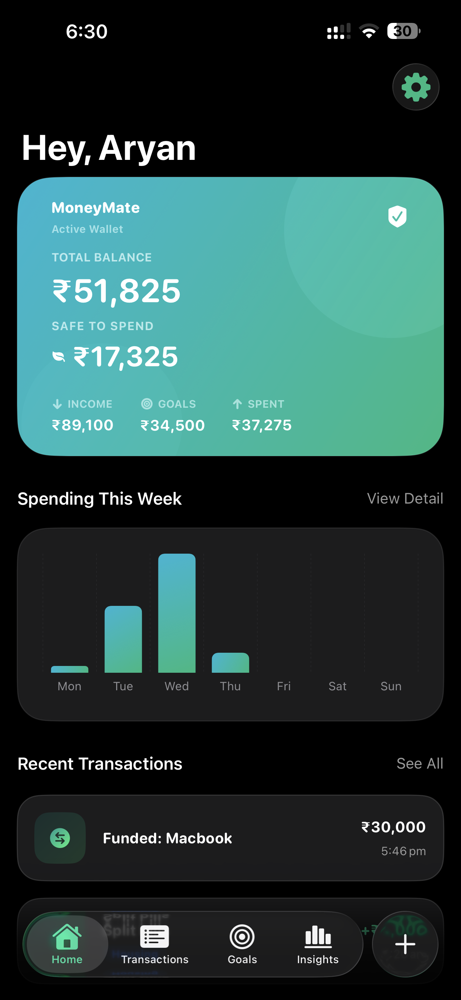
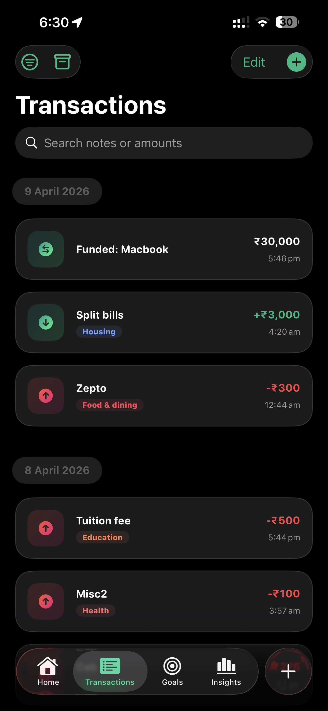
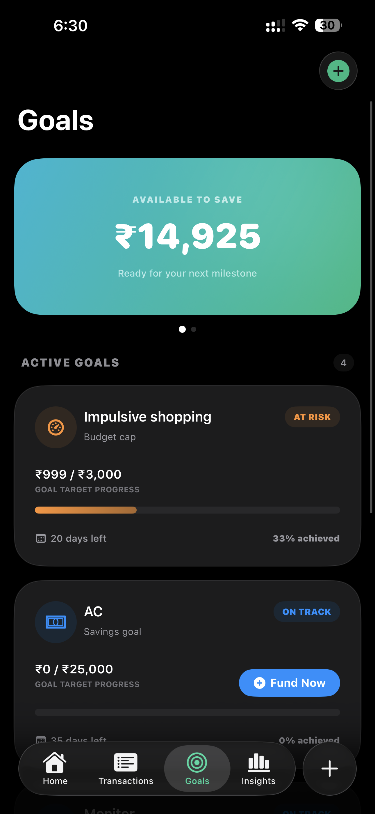
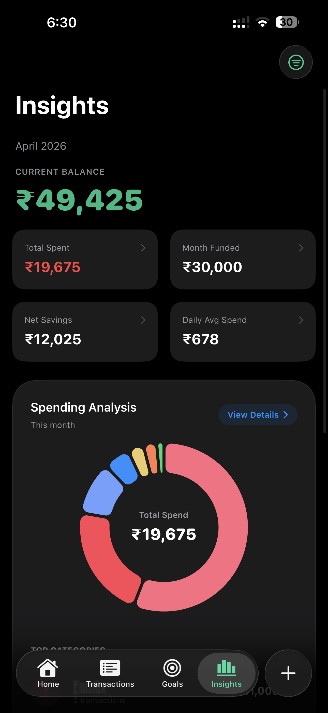
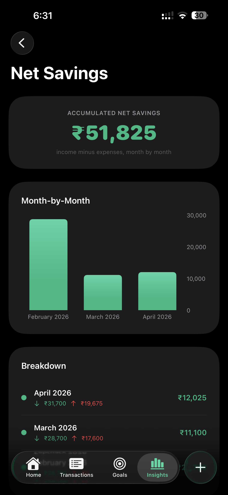
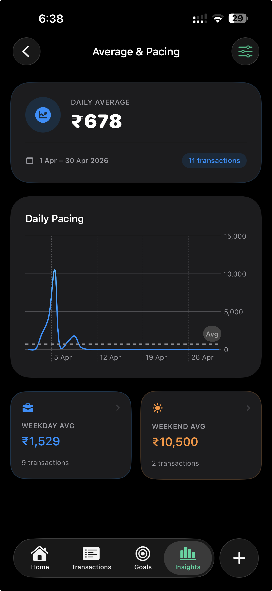
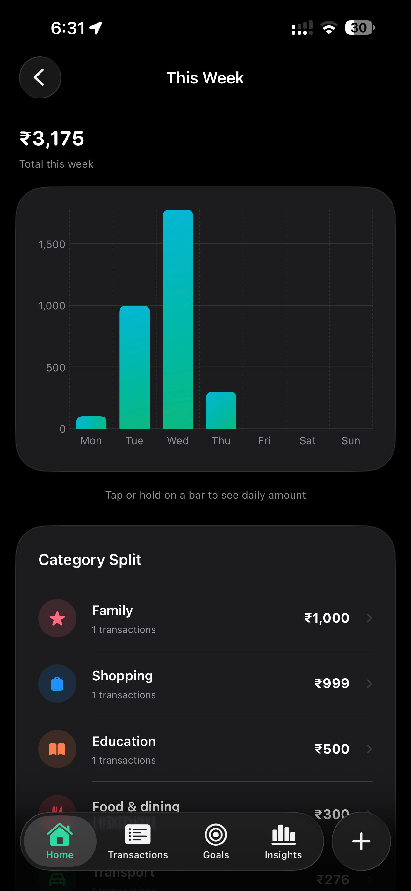

# MoneyMate — Your Personal Finance Companion

MoneyMate is a high-performance, natively-built personal finance tracker designed to transform how users interact with their money. While most trackers stop at simple lists, MoneyMate focuses on **automated insights, habit gamification, and absolute data integrity**.

  
  
  
  

## 🚀 Key Pillars of MoneyMate

### 1. The "Universal Access" Workflow
- **Global Action Hub:** A centrally placed, always-accessible `+` button in the persistent tab bar allows users to log income or expenses from any screen instantly.
- **Advanced Transaction Engine:** A searchable and filterable ledger that supports detailed notes and category tagging.
- **Seamless Archive Flow:** Transactions aren't just deleted; they can be moved to a secure **Archive Vault** for 30 days before permanent removal, preserving your balance history while keeping your primary view clean.

### 2. Analytical Intelligence (Insights)
- **Dynamic Spending Analysis:** A professional donut-chart breakdown of your spending habits, automatically identifying your **Top 3 Spending Categories**.
- **Historical Drills:** By default, the app provides a monthly summary, but users can toggle between Weekly, Monthly, or Yearly perspectives with interactive charts.
- **Trend Visualization:** Dedicated views for Daily, Weekly, and Monthly historical data to spot spending spikes before they become habits.

  
  

### 3. Gamified Goal Architecture
- **Multi-Dimensional Goals:** Set more than just a savings target. MoneyMate supports:
    *   **Savings Goals:** Track progress toward a specific purchase.
    *   **Budget Caps:** Strictly monitor spending within a chosen category.
    *   **No-Spend Challenges:** Gamify discipline by tracking "success streaks."
    *   **Daily Spending Limits:** Maintain day-to-day financial health.
- **"Safe to Spend" Intelligence:** The app dynamically calculates exactly how much of your total balance is actually available after accounting for your funded goals.

### 4. Native Security & Smart Notifications
- **Biometric Security:** Integrated **Face ID** and Passcode protection ensures your sensitive financial data remains private.
- **Proactive Alerts:** A smart notification system that goes beyond reminders:
    *   **Daily Log Reminders:** Set a custom time for a daily check-in.
    *   **Threshold Notifications:** Receive "Encouraging Alerts" when a goal is 90% reached and "Congratulations" at 100%.
    *   **Budget Warnings:** Get notified when you are approaching your set budget caps.

### 5. Data Mobility
- **One-Click CSV Export:** Master your data outside the app. Export your entire transaction history (including archived items) into a standardized CSV format for use in Excel or Google Sheets.

---

  

## 🏗️ Technical Stack
- **SwiftUI + Observation:** Reactive, fluid UI.
- **SwiftData:** Reliable, local-first persistence.
- **Swift Charts:** High-fidelity data visualization.
- **LocalAuthentication:** Native biometric security.

## 🛠️ Setup Instructions
1.  **Environment**: Requires **Xcode 26.0+** and **iOS 26.0+**.
2.  **Open**: Launch `PaymentTracker.xcodeproj`.
3.  **Run**: Select any modern iPhone simulator and press `Cmd + R`.
4.  **Face ID**: To test security, enable `Features > Face ID > Enrolled` in the Simulator.

---
*Built with precision for the modern personal finance enthusiast.*
